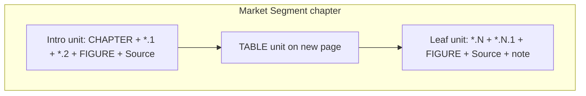

# Pagination diagnosis (excluding Regional Analysis)

Compared:
- GOLDEN: `Sample_SI10002_AI Data Center Market_Report.pdf` (132 pages)
- CURRENT: `Sample_Report (17).pdf` (154 pages)

Chapter 5 Regional Analysis excluded. Content/market names differ (AI Data Center vs Japan Wine); rules below are structural page-unit rules from the golden layout.

---

## 1. Pagination differences

### A. Market Segment chapters (Ch2–4) — highest impact

| Golden | Current |
|---|---|
| One intro page: `CHAPTER` + `*.1` + `*.2` + `FIGURE` + `Source` | Intro headings on one page; `FIGURE` + `Source` on the next (split) |
| Next page: `TABLE` + data + `Source` only | Table page also appends next leaf headings (`2.3` / `2.3.1`) into leftover space |
| Leaf chart page: heading + `*.N.1` + `FIGURE` + `Source` + deliverable note together | Leaf heading / figure / note split across pages; next leaf starts in leftover space |
| Blank page before Ch2: no | Current **p26 blank** before Ch2 |

Example (Ch2): golden p31→p32→p33 vs current p27→p28→p29→p30→p31.

### B. Executive Summary (Ch1)

| Golden | Current |
|---|---|
| `CHAPTER` + `1.1` + `1.1.1` + `TABLE` + `Source` as one block | Same, but **`1.2` starts on that same page** |
| COVID body on its own following page | COVID text/subheads fragmented; `1.2.3` packed with COVID figure |
| `1.3` + `FIGURE 2` + `Source` together | **`1.3` stranded** (p24); figure/source on p25 |
| Clean handoff to Ch2 | Extra blank p26 from duplicate chapter break |

### C. Competitive Landscape (Ch6)

| Golden | Current |
|---|---|
| `CHAPTER` + `6.1` + `FIGURE` + `Source` together | Headings stranded; figure/source on next page |
| Each company revenue/share **TABLE on its own page** | Both tables packed on one page; `6.2` starts on that page |
| Each of `6.2.1` / `6.2.2` / `6.2.3` = heading + `TABLE` + `Source` on its own page | All three strategic subsections packed together |

### D. Company Profiles (Ch7)

| Golden | Current |
|---|---|
| `CHAPTER 7` starts on same page as first company | **`CHAPTER 7` alone** (p100), then first company after `AreaBreak` |
| Chart units `*.4` / `*.5`: heading + `FIGURE` + `Source` together | `*.4` heading stranded from figure; blank/underfilled pages (e.g. p105/111/117/123/129) before `*.6` |
| Later companies in golden sample are heading-list only | Current fully expands every company (content set differs); pagination still wrong within each full profile |

### E. Industry Analysis (Ch8)

| Golden | Current |
|---|---|
| `8.2` + figure + source on one page | `8.1`/`8.2` packed after Ch8 start; figure on next page |
| Each `8.2.x` impact table on its own page | Multiple impact tables packed (p133–134) |
| Each later figure section (`8.3`–`8.7.x`) is its own page unit | Headings often stranded from figures; next section starts in leftover whitespace |

### F. Marketing Strategy / Conclusions / Methodology (Ch9–11)

- Ch9: golden keeps `9.1` + Market Channels figure together; current strands `9.1` from figure. `9.2`–`9.4` + development-trend figure packing differs.
- Ch10: golden gives `10.1` / `10.2` separate pages; current packs both under the chapter page.
- Ch11: both separate some methodology figures; current packs more section text and still separates some figures from headings. Lower severity than A–E.

---

## 2. Correct page-unit rules (from golden)

Apply the same unit model already used for Regional Analysis:

1. **Segment intro unit (atomic):** `CHAPTER N` + `N.1` Overview + `N.2` Share heading + share `FIGURE` + `Source` (+ note if present).
2. **Segment table unit:** global-by-dimension `TABLE` + data + `Source` starts on a **new page**; no leaf content appended into leftover space.
3. **Segment leaf chart unit:** `N.x` + `N.x.1` + `FIGURE` + `Source` + deliverable note; each leaf with a figure starts on a **new page**.
4. **Do not** force every numbered heading alone onto a new page — only defined units.
5. **Executive:** keep `1.1` table unit separate from COVID block; COVID figure page; `1.3` chart unit kept together; one break into Ch2 (no blank page).
6. **Competitive:** intro chart unit; each revenue/share table unit; each `6.2.x` table unit — each on its own page.
7. **Company profile:** chapter heading shares page with first company start; each company after the first may start on a new page; chart subsections stay heading+figure(+source) together; avoid blank pages between figure and following subsection.
8. **Industry / strategy figure-table sections:** one section unit per page (heading + figure/table + source).

---

## 3. Exact renderer / method to change

| Problem | Class | Method |
|---|---|---|
| Segment intro/table/leaf packing; no unit breaks | [`MarketSegmentRenderer.java`](src/main/java/com/sample_generator/sample/pdf/renderers/MarketSegmentRenderer.java) | `renderRootBlock`, `renderLeafSegment` |
| Blank page before Ch2 (duplicate break) | [`PdfRenderer.java`](src/main/java/com/sample_generator/sample/pdf/PdfRenderer.java) + `MarketSegmentRenderer.renderChapter` | orchestration `AreaBreak` after `addExecutiveSummary` (line ~173) **and/or** opening `AreaBreak` in `renderChapter` (line ~85) — remove one |
| Exec packing / stranded `1.3` / COVID breaks | `PdfRenderer` | `addExecutiveSummary` (incl. double `AreaBreak` around `addCovidImages`, ~2040–2042) |
| Competitive packing | `PdfRenderer` | `addCompetitiveLandscape`, `addStrategicDevelopmentSubsection` |
| Chapter-alone + chart split / blanks | `PdfRenderer` | `addCompanyProfiles`, `addCompanyProfile` (opening `AreaBreak` at ~971 before every company including first) |
| Industry packing / stranded figures | `PdfRenderer` | `addIndustryAnalysis`, `addIndustryImpactTable` |
| Strategy heading/figure split | `PdfRenderer` | `addMarketStrategyAnalysis` |
| Conclusions packing (lower priority) | `PdfRenderer` | `addReportConclusions` |
| Methodology packing (lower priority) | `PdfRenderer` | `addResearchMethodology` |

Not in scope to change: `RegionalAnalysisRenderer`, `BodyFigureLayout`, `BodyTableStyling`, header/footer, margins, fonts, colors, TOC, numbering, data.

Note: `BodyFigureLayout.breakBeforeNumberedHeading` only sets color + `keepWithNext` — it does **not** create page breaks. Oversized `keepTogether` figures can still orphan headings; unit `AreaBreak`s are what enforce golden page boundaries.

---

## 4. Smallest implementation approach

Mirror the Regional Analysis fix: **only add/remove `AreaBreak`s** at unit boundaries. No refactor, no styling changes.

1. **MarketSegmentRenderer (do first)**
   - After intro `Source`, `document.add(new AreaBreak())` before the global `TABLE`.
   - At start of `renderLeafSegment`, `AreaBreak` before each leaf chart unit.
   - Remove duplicate chapter-start break (PdfRenderer post-exec `AreaBreak` **or** `renderChapter` opening break — keep exactly one).

2. **PdfRenderer.addCompetitiveLandscape**
   - `AreaBreak` after intro figure/source before first company table; between the two company tables; before each `addStrategicDevelopmentSubsection` (or inside that method).

3. **PdfRenderer.addCompanyProfile / addCompanyProfiles**
   - Skip `AreaBreak` before the **first** company so `CHAPTER 7` shares the page with `7.1`.
   - Keep `AreaBreak` before subsequent companies.
   - `AreaBreak` before chart units `*.4` / `*.5` (and ensure source stays with each figure unit so blank interstitial pages disappear).

4. **PdfRenderer.addIndustryAnalysis / addIndustryImpactTable**
   - `AreaBreak` before each figure section and each impact-table unit.

5. **PdfRenderer.addExecutiveSummary**
   - `AreaBreak` before `1.2` so it does not share the table page.
   - Keep single dedicated break for COVID figure page; remove the extra break that strands `1.3` from its figure.
   - Ensure only one break into segment chapters (ties to step 1).

6. **PdfRenderer.addMarketStrategyAnalysis** (then Ch10/Ch11 if still wrong after visual check)
   - `AreaBreak` so `9.1`+figure+source stay a unit; separate development-trend figure unit from prior text as in golden.

Stop after compile; verify against golden page-unit boundaries (not identical page numbers, given different datasets).
